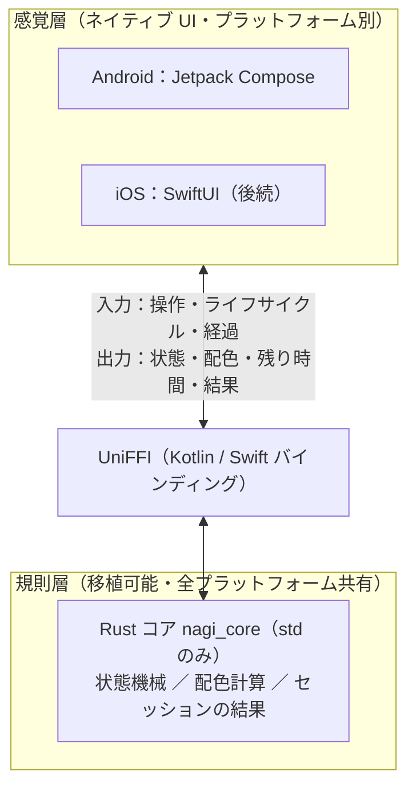

# Nagi（凪）

通知と情報の渦から離れ、**何もしない時間を作って守る**ためのアプリ。生産性ツールではなく、意図的な「余白」を肯定し保護する Slow Tech / Calm Technology プロダクト。

最初の feature は **凪の刻（Nagi Time）** — ユーザーが選んだ 1〜30 分のあいだ、スマートフォンの操作を意図的に手放すための体験。進行中に操作したり別アプリへ移ろうとすると画面が乱れ、最終的にタイマーが静かに最初へ戻る（罰ではなく、中断されない休息のための仕掛け）。

> 背景・市場・ビジョンの詳細は [`docs/01_Background.md`](docs/01_Background.md) を参照。

## 設計原則

すべての feature が従う原則（[`docs/01_Background.md`](docs/01_Background.md) §4 が所有）:

- **Anti-Gamification** — 連続記録・バッジ・達成を促す通知を持たない。ユーザーの行動を強制も誘導もせず、保護に徹する
- **Ambient & Tactile UI** — 色彩・触覚・環境音で穏やかに導く。意識の中心を占めない
- **Quiet Architecture** — 実行時のエネルギー消費を抑える（GC を持たない省電力な言語をコアに用いる）
- **Local-First** — データは端末内にのみ保存し、外部サーバーへ常時同期しない
- **重要な割り込みは妨げない** — 電話・緊急速報など安全に関わる割り込みは例外とする

## アーキテクチャ

**「規則」と「感覚」を二層に分ける設計**（[`docs/03_DD_NagiTime.md`](docs/03_DD_NagiTime.md) Q1）。規則は端末に依存しない純粋な論理として Rust に、感覚は各プラットフォームのネイティブ UI に置き、UniFFI でつなぐ。**Android 先行 → iOS 後続**で、コアは両者で再利用する。



この分離により、プラットフォームを変えても規則のコアは変わらない（iOS→Android の方針転換でもコアは無変更だった）。

## リポジトリ構成

```
Nagi/
├─ docs/                 仕様文書（下記「ドキュメント」参照）
├─ rust/                 Rust サブツリー（Cargo workspace）
│  ├─ Cargo.toml
│  └─ core/              nagi_core ＝ 規則の層（純粋ロジック・std のみ）  ← 実装済み
│     └─ src/{lib.rs, palette.rs}
├─ android/              Android アプリ ＝ 感覚の層（Jetpack Compose）      ← 今後（FFI/UniFFI 後）
├─ ios/                  iOS アプリ ＝ 感覚の層（SwiftUI）                  ← 後続
├─ .gitignore
└─ README.md
```

> `rust/ffi`（UniFFI 公開層）と `android/` は後続 PR で追加予定。

## 開発状況

| 領域 | 状態 |
|---|---|
| 規則コア（状態機械・配色・セッションの結果） | ✅ 実装・テスト済み（`cargo test` 23件 / clippy クリーン） |
| UniFFI 公開層（`rust/ffi`） | ⏳ 予定 |
| Android アプリ（Compose・音・触覚・ビルド統合） | ⏳ 予定 |
| iOS アプリ | 🔮 後続 |

コアが持つもの（[`docs/03_DD_NagiTime.md`](docs/03_DD_NagiTime.md) Q3/Q4/Q5）:
- **状態機械** `NagiTimer` — 乱れゲージによる段階的な引き戻し、別アプリ離脱で即リセット、OS 割り込みでポーズ
- **配色計算** `palette_for` — 時間帯 → 隣り合う色相（アナロガス）のグラデーション
- **セッションの結果** — 完走 / 中断（要因: 操作の乱れ / 離脱）の報告と記録構造（成功指標である完走率を計測する土台）

## ビルドと検証

### 規則コア（いま動く）

```bash
cd rust
cargo test                                  # ユニットテスト
cargo fmt --check                           # 公式 Style Guide（rustfmt）
cargo clippy --all-targets -- -D warnings   # lint
```

外部クレートに依存しない（std のみ）ため、オフラインで再現できる。

### アプリ全体（今後）

UniFFI ＋ Android のビルド統合を追加後に必要となる前提:

- JDK 17、Android SDK ＋ NDK
- Rust の Android ターゲット（`rustup target add aarch64-linux-android …`）
- `cargo-ndk`（各 ABI の `.so` 生成）、`uniffi-bindgen`（Kotlin バインディング生成）

> ビルド手順は `android/` 追加時に本節へ追記する。

## ドキュメント

番号順が読む順（前提となる文書ほど小さい番号）:

1. [`docs/00_Research.md`](docs/00_Research.md) — 市場調査（生データ）
2. [`docs/01_Background.md`](docs/01_Background.md) — プロダクトビジョン・設計原則（最上位）
3. [`docs/02_PRD_NagiTime.md`](docs/02_PRD_NagiTime.md) — 凪の刻の Why / What
4. [`docs/03_DD_NagiTime.md`](docs/03_DD_NagiTime.md) — 凪の刻の How（技術設計）

## 開発フロー

ブランチ・コミット・PR の規約は [`CONTRIBUTING.md`](CONTRIBUTING.md) に集約（CI で強制）。要点のみ:

- `main` は直線履歴（マージコミット禁止）、**1 PR = 1 commit**。
- Issue / PR / コミットのタイトルは `[カテゴリ]` 接頭辞で揃える（例 `[Rust]`）。コミット件名は PR タイトル＋末尾ピリオド。
- PR 本文で `Closes #<番号>` を書き、対応 Issue を参照する（マージで Issue が閉じる）。
- コミット前に `cargo fmt --check` と `cargo clippy --all-targets -- -D warnings` を通す。

## ライセンス

未定（TBD）。
